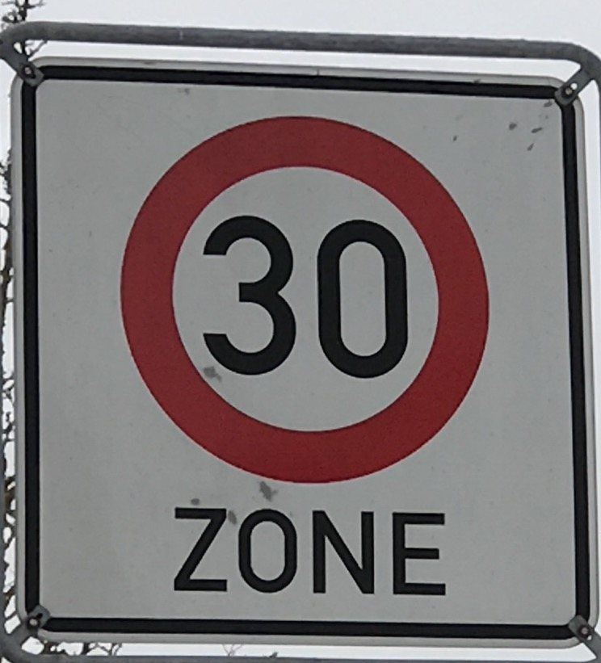
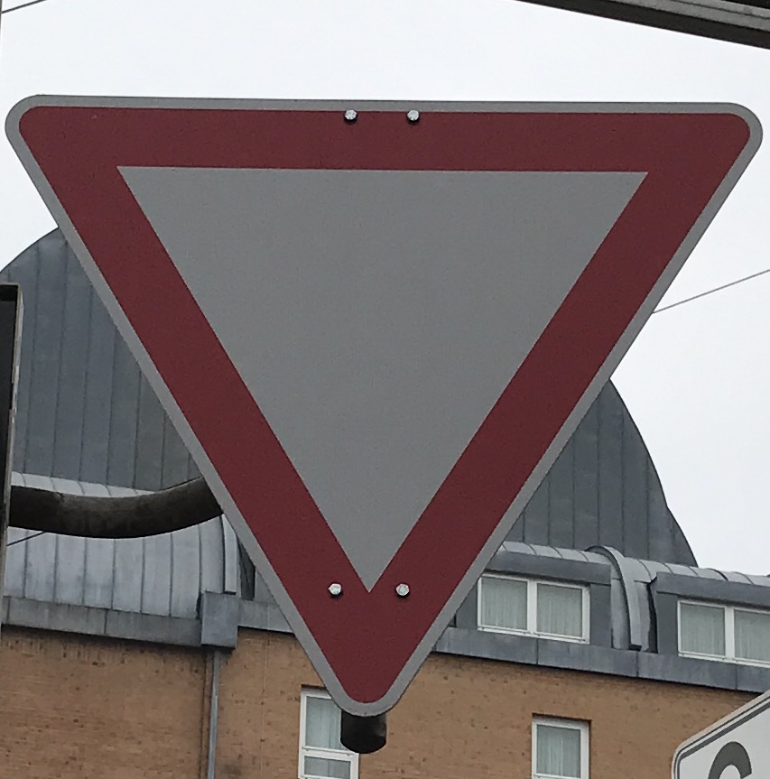
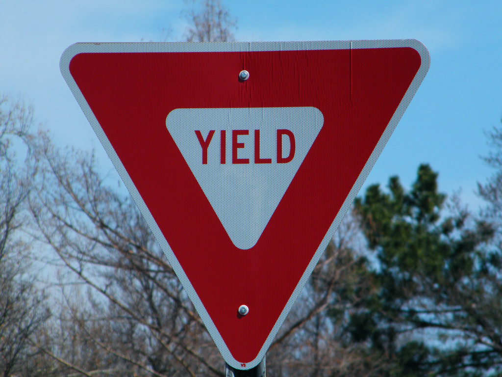
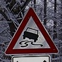
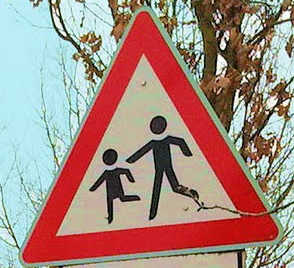

#**Traffic Sign Recognition** 

---

**Build a Traffic Sign Recognition Project**

The goals / steps of this project are the following:
* Load the data set (see below for links to the project data set)
* Explore, summarize and visualize the data set
* Design, train and test a model architecture
* Use the model to make predictions on new images
* Analyze the softmax probabilities of the new images
* Summarize the results with a written report

[//]: # (Image References)

[image1]: ./report-images/explore-training-set.png "Training set distribution"
[image2]: ./report-images/explore-validation-set.png "Validation set distribution"
[image3]: ./report-images/explore-test-set.png "Test set distribution"

[image11]: ./report-images/model1-prediction-errors.png "Model1 prediction errors"
[image12]: ./report-images/model2-prediction-errors.png "Model2 prediction errors"
[image13]: ./report-images/model3-prediction-errors.png "Model3 prediction errors"

[sample01]: ./report-images/sample01.png
[sample02]: ./report-images/sample02.png 
[sample03]: ./report-images/sample03.png 
[sample04]: ./report-images/sample04.png 
[sample05]: ./report-images/sample05.png 
[sample06]: ./report-images/sample06.png 
[sample07]: ./report-images/sample07.png 
[sample08]: ./report-images/sample08.png 
[sample09]: ./report-images/sample09.png 
[sample10]: ./report-images/sample10.png 
[sample11]: ./report-images/sample11.png 
[sample12]: ./report-images/sample12.png 
[sample13]: ./report-images/sample13.png 
[sample14]: ./report-images/sample14.png 
[sample15]: ./report-images/sample15.png 
[sample16]: ./report-images/sample16.png 

[activation1_0]: ./report-images/image1_activation0.png
[activation2_0]: ./report-images/image2_activation0.png
[activation2_5]: ./report-images/image2_activation5.png
[activation3_5]: ./report-images/image3_activation5.png

## Rubric Points
###Here I will consider the [rubric points](https://review.udacity.com/#!/rubrics/481/view) individually and describe how I addressed each point in my implementation.  

---
###Writeup / README

####1. Provide a Writeup / README that includes all the rubric points and how you addressed each one. You can submit your writeup as markdown or pdf. You can use this template as a guide for writing the report. The submission includes the project code.

You're reading it! Here is:

* [Github repo](https://github.com/gojira/CarND-Traffic-Sign-Classifier-Project)
* [Project code](https://github.com/gojira/CarND-Traffic-Sign-Classifier-Project/blob/master/Traffic_Sign_Classifier.ipynb)
* [Jupyter notebook output saved as HTML](https://github.com/gojira/CarND-Traffic-Sign-Classifier-Project/blob/master/Traffic_Sign_Classifier.html)

###Data Set Summary & Exploration

####1. Provide a basic summary of the data set. In the code, the analysis should be done using python, numpy and/or pandas methods rather than hardcoding results manually.

I used the numpy library to calculate summary statistics of the traffic
signs data set:

* The size of training set is 34799
* The size of the validation set is 4410
* The size of test set is 12630
* The shape of a traffic sign image is (32,32,3)
* The number of unique classes/labels in the data set is 43

####2. Include an exploratory visualization of the dataset.

Here are exploratory visualizations of the data sets.

First, in the [code](https://github.com/gojira/CarND-Traffic-Sign-Classifier-Project/blob/master/Traffic_Sign_Classifier.html), I output a random set of 25 images with their labels to familiarize myself with the image set.

The labels were loaded from signnames.csv into a pandas data frame for easy access.

Next, I plotted the class distributions in each data set - training, validation, and test.  We can see that the datasets are not particularly balanced.  We see that the training and test sets are very well matched in class distribution. The validation set is roughly similar, but appears tob e quantized into increments of roughly 25.

![alt text][image1]
![alt text][image2]
![alt text][image3]

###Design and Test a Model Architecture

####1. Describe how you preprocessed the image data. What techniques were chosen and why did you choose these techniques? Consider including images showing the output of each preprocessing technique. Pre-processing refers to techniques such as converting to grayscale, normalization, etc. (OPTIONAL: As described in the "Stand Out Suggestions" part of the rubric, if you generated additional data for training, describe why you decided to generate additional data, how you generated the data, and provide example images of the additional data. Then describe the characteristics of the augmented training set like number of images in the set, number of images for each class, etc.)

I approached data transformation & augmentation based on whether it was needed by the model.

The steps I took are the following.

1. Resize image to 32x32x3 as needed.  Clearly this was not needed for the provided dataset, but it is needed for most sample images obtained from the web.  This is the first step before any other image processing.
2. Normalize pixel value ranges to [-1,1]
3. Experiment with data augmentation such as flipping, rotating, shifting images.  Since I am using Keras (see more below in model architecture), I used its built-in support for image data generation.

In the end, I did not spend a lot of time with data augmentation as model test accuracy reached 0.98 with only normalization.

If I had needed to, I would have taken these further steps.

1. Test grayscale.
2. Manually generate flipped, translated (shifted), and rotated images to balance out the class distribution.

####2. Describe what your final model architecture looks like including model type, layers, layer sizes, connectivity, etc.) Consider including a diagram and/or table describing the final model.

My final model is a straightforward convolutional neural network similar to the basic
Keras CIFAR-10 model.

It is loosely based on Alexnet but sized for 32x32x3 images that is suitable for the
traffic sign data set as well as for CIFAR-10.

The model has the following properties

* Classic convnet with convolution and max pooling
* 2 convolution + 1 max pooling, repeated twice
* Dropout after max pooling and the first fully connected layer
* Batch norm before each activation layer
* Relu activation
* L2 regularization

The model consisted of the following layers. The notebook and HTML output have diagrams of the network.

| Layer				| Output Shape	| Description |
|:-----------------:|:--------------:|:-----------:|
| Input				| 32x32x3			| Input RGB image | 
| 3x3 Convolution	| 32x32x32		| 32 filters, stride=1, same padding |
| Batch Norm			| 32x32x32		| |
| Activation			| 32x32x32		| Relu |
| 3x3 Convolution	| 30x30x32		| 32 filters, stride=1 |
| Batch Norm			| 30x30x32		| |
| Activation			| 30x30x32		| Relu |
| Max Pooling			| 15x15x32		| 2x2 pooling |
| Dropout				| 15x15x32		| Keep = 0.25 |
| 3x3 Convolution	| 15x15x64		| 64 filters, stride=1, same padding |
| Batch Norm			| 15x15x64		| |
| Activation			| 15x15x64		| Relu |
| 3x3 Convolution	| 13x13x64		| 64 filters, stride=1 |
| Batch Norm			| 13x13x64		| |
| Activation			| 13x13x64		| Relu |
| Max Pooling			| 6x6x64			| 2x2 pooling |
| Dropout				| 6x6x64			| Keep = 0.25 |
| Flatten				| 2304				| |
| Fully connected	| 512				| |
| Batch Norm			| 512				| |
| Activation			| 512				| Relu |
| Dropout				| 512				| Keep = 0.25 |
| Fully connected	| 43				| Fully connected layer with outputs = # of classes |
| Batch Norm			| 43				| |
| Activation			| 43				| Softmax for classification |

 

####3. Describe how you trained your model. The discussion can include the type of optimizer, the batch size, number of epochs and any hyperparameters such as learning rate.

The final training uses the following.

1. Adam Optimizer with Keras defaults, including learning rate of 0.01
2. Batch size: 128
3. Number of epochs: The final model uses 30 epochs with optional early stopping
4. L2 regularization at 0.001

There is some discussion on approach to arrive at the hyperparameters in next section.

####4. Describe the approach taken for finding a solution and getting the validation set accuracy to be at least 0.93. Include in the discussion the results on the training, validation and test sets and where in the code these were calculated. Your approach may have been an iterative process, in which case, outline the steps you took to get to the final solution and why you chose those steps. Perhaps your solution involved an already well known implementation or architecture. In this case, discuss why you think the architecture is suitable for the current problem.

My final model results were:

* training set accuracy of 0.99
* validation set accuracy of 0.98
* test set accuracy of 0.98

I started by adapting the sample LeNet model and code.  I got reasonable results of over 0.95 validation accuracy.  However, I found LeNet a little cumbersome to modify and experiment with.

As a result, I decided to start again from scratch using Keras with a standard CIFAR-10 CNN model.  I immediately got better results with the Keras model so I switched all subsequent efforts to Keras.

For Keras, I started with Keras 1 with Tensorflow 0.12 in the carnd-term1 environment but encountered errors.  Because Keras 2 is better maintained, I switched to Keras 2 with Tensorflow 1.2 in its own environment.  I got much better results with this compared to trying with the carnd-term1 environment.

With Keras, it was very quick and easy to experiment with dropout, regularization, and batch normalization.  In my experiements, I found dropout gave the biggest bang in terms of adding generalization to the model by better validation and test set results.  My model includes L2 regularization as it also improved results although less so than dropout.

I did manual tuning of the following:

* Optimizer: I tried standard SGD and Adam.  SGD was considerably slower (it took an order or two magnitude slower at first and rather than searching for better hyperparameters with SGD, I spent more time tuning Adam)
* Learning rate: I experimented with learning rate with my initial LeNet model as well as with SGD, but found Adam converged fast and with good accuracy.
* Dropout keep rate: I tried several different dropout percentages including 0, 0.25, 0.5, 0.8, and 1.0.  In the end the standard 0.5 and 0.25 worked well.  Dropout had the biggest contribution to reducing overfitting and improving test set accuracy.
* L2 regularization: I experimented both with and without and found using parameters of about 0.001 worked well.
* Train with and without batch normalization.  Batch normalization generally led to faster improvements in test set accuracy, and better accuracy in validation and test set.

My result notebook includes 3 different models:

* Normalized dataset without batch normalization
* Normalized dataset with batch normalization
* Normalized AND augmented dataset without batch normalization

The best results come from normalized dataset with batch normalization.  That approach generally, although not always, yielded better validation and test set accuracy compared to the same without batch normalization.  The accuracy difference was around 0.01.

The data augmentation results using Keras image data support yielded lower accuracy than the unaugmented dataset.  I ran this model with up to 250 epochs but it still did not reach more than about 0.96 accuracy in validation set.  It may be promising to investigate this further, but given that my unaugmented data model yielded test set accuracy of up to 0.98, I did not pursue this.

#### Comparison of model accuracy

It is interesting to plot the histogram of inaccurate classifications for each model, and from each training run.  Note that the bar charts are drawn to different scale so care must be taken when comparing 'heights'.

![alt text][image1]
![alt text][image11]
![alt text][image12]
![alt text][image13]

The availability of data (i.e., more samples) does not necessarily correlate with reduced errors.  For example, there are a lot of samples for the classes 1-13, but all the models have some degree of error for these (note that labels 1-8 are all speed limit signs which are similar in shape and only vary in the speed limit itself).  Conversely, labels 14-16 have fewer samples, but all the models do pretty well for these.  These include yield and stop which have unique shapes.

Note that the highest count of errors by model varies between models, and also changes for a given model between runs. 

#### Some more notes

1. I did not save any of the models as results were easy to reproduce.
2. For visualization of the training and models, I tried the Tensorboard callback from Keras.  This yielded some promising explorations, but unfortunately there is an unresolved bug in this integration that results in training failures as documented in github and Stack Overflow.  As a result, I was unable to incorporate this in the final results. 

###Test a Model on New Images

####1. Choose five German traffic signs found on the web and provide them in the report. For each image, discuss what quality or qualities might be difficult to classify.

I found a total of 16 images on the web.  Here are 5 of them.

The first image might be difficult to classify because it includes the word "ZONE".  The 4th and 5th images are both yield but of different forms.

####2. Discuss the model's predictions on these new traffic signs and compare the results to predicting on the test set. At a minimum, discuss what the predictions were, the accuracy on these new predictions, and compare the accuracy to the accuracy on the test set (OPTIONAL: Discuss the results in more detail as described in the "Stand Out Suggestions" part of the rubric).

The predictions and probabilities are discussed together in the next section.

####3. Describe how certain the model is when predicting on each of the five new images by looking at the softmax probabilities for each prediction. Provide the top 5 softmax probabilities for each image along with the sign type of each probability. (OPTIONAL: as described in the "Stand Out Suggestions" part of the rubric, visualizations can also be provided such as bar charts)

Here are the results of the predictions using model2, which had the highest average test accuracy across many runs:

![alt text][sample01]
![alt text][sample02]
![alt text][sample03]
![alt text][sample04]
![alt text][sample05]
![alt text][sample06]
![alt text][sample07]
![alt text][sample08]
![alt text][sample09]
![alt text][sample10]
![alt text][sample11]
![alt text][sample12]
![alt text][sample13]
![alt text][sample14]
![alt text][sample15]
![alt text][sample16]

The model was able to correctly guess 16 of the 16 traffic signs, which gives an accuracy of 100%. This compares favorably to the accuracy on the test set of 97.9%.

The code for making predictions on my final model is located in cell 31 of the Jupyter notebook.

This model assigns probabilities as follows

1. Probability .99 or higher for 9 out of 16
2. Probability .97 or higher for 13 out of 16
3. Probability around .90 for 2 out of 16
4. Probability around .80 for 1 out of 16

THe lowest probability was assigned to sample 15, which has the 30kph sign with text "ZONE".  It is natural for the probability to be lower here as it is not in the training set, but fortunately the model generalizes enough that it still correctly predicts it.

The 2 samples wih around 0.90 probability are both triangular, one pointing 'up' and one pointing 'down'.  One of them is a yield sign with text in it.  While this seems consistent with the 30kph+ZONE example, for most runs I made with the model, both yield signs usually were predicted with high probability so it is not immediately clear why it had a lower probability in this final run.

### (Optional) Visualizing the Neural Network (See Step 4 of the Ipython notebook for more details)
####1. Discuss the visual output of your trained network's feature maps. What characteristics did the neural network use to make classifications?

The .ipynb and HTML files provide visualization of several layers using 3 different image samples from the Web samples (not the training/validation/test samples).

Activations were visualized from the following layers.

1. First convolution layer (layer 0)
2. Second Relu layer (layer 5)
3. 3rd convolution layer (layer 8) - the first conv layer after max pooling

####Layer 0 Activations

It is interesting to compare the activations between the first two images.  These are slippery road and children crossing, which have the same shape but different images inside.

![alt text][activation1_0]
![alt text][activation2_0]

Many of the feature maps have similar activation for both images.

FeatureMap 7, 9, 10, 11, 18, and 30 have significantly different activation in the image border area of the two images.  This suggests that these feature maps are picking up the difference in the border color or the difference of the inside image in the two signs.  FeatureMap 7 shows particularly high contrast for the inside of the image.  Since the two images have slightly different rotation, that might also be a feature that the feature maps are detecting.  

In addition, FeatureMap 2, 12, 17, and 28 have darker regions that are clearly picking up on the darker background of the slippery road sign image.

####Layer 5 Activations 

Layer 5 is a Relu activation layer.  For this I am showing the children crossing sign and the 80kph sign.

![alt text][activation2_5]
![alt text][activation3_5]

There are some significant differences in the characteristics of the two images.

1. Background: The 80kph image is a nightshot with dark background.  The children crossing sign has daytime sky adn tree branches behind the sign.
2. Shape: One sigh is circular and one is triangular.
3. Light: The 80kph sign has very high luminosity in the sign, where the other sign is less pronounced.
4. Complexitiy: The children crossing image has a lot more sign and shape segments compared to the 80kph image which is simpler. The 80kps sign has no straight lines where the other one has both straight lines and other types of line segments.

Correspondingly there are a lot of variations between the activations.  The 80kph activations seem to map almost completely directly to the image.  In the children crossing image, there are many more activations that don't obviously correlate to what is in the picture - but suggestive of directional orientation or other characteristics.

FeatureMap 23 is the only one for the 80kph image that appears fully activated for the image border.  It is also highly activated for the children crossing image.  This may suggest that it represents the color of the sign border.
